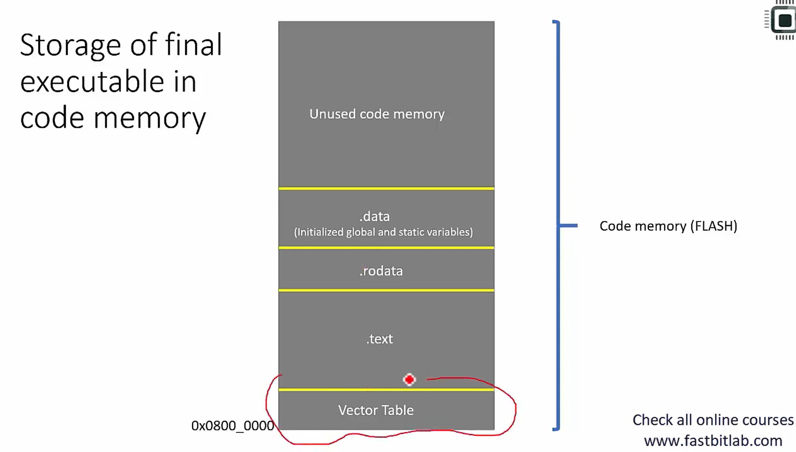
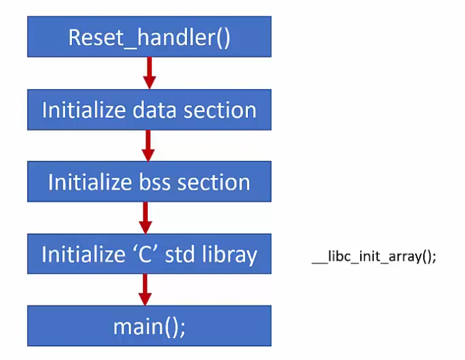

- before configuring any peripheral. first enable the peripheral clock. otherwise peripheral won't take configuration.

- to enable peripheral clock. use peripheral clock registers.

# 1. Write Device header file 

-----
Startup file:
- runs before main
- initialises vector table
- first address points to the MSP (main stack pointers)
- second address point to the reset handler
- initialises .data and .bss section in SRAM
- call main()

---------------
Vector Table
- holds adresses of exception handlers (system handlers and interrupts)
- 15 system exceptions and 240 interrupts
- vector table is stored at the initial of Flash memory

-------------------
Linker Script
- _etext - counter for end of text
- _sdata - start of data section
- _sbss - start of bss( uninitialised data)

# GPIO Registers

1. GPIO Mode Register: sets the mode of the GPIO pin. by default the GPIO is in input mode. 
2. GPIO output type register: sets the output mode of the gpio ie: open drain / push-pull.
3. GPIO output speed register: controls the rise time and fall time of the output GPIO pin.
4. GPIO pull up/ pull down register: controls the pull up/down resistors.
5. GPIO input data register: is a read only register. stores the input data and program should read from this register.
6. GPIO output data register:
7. Alt func high and low register: used to set alt functanality of the GPIO